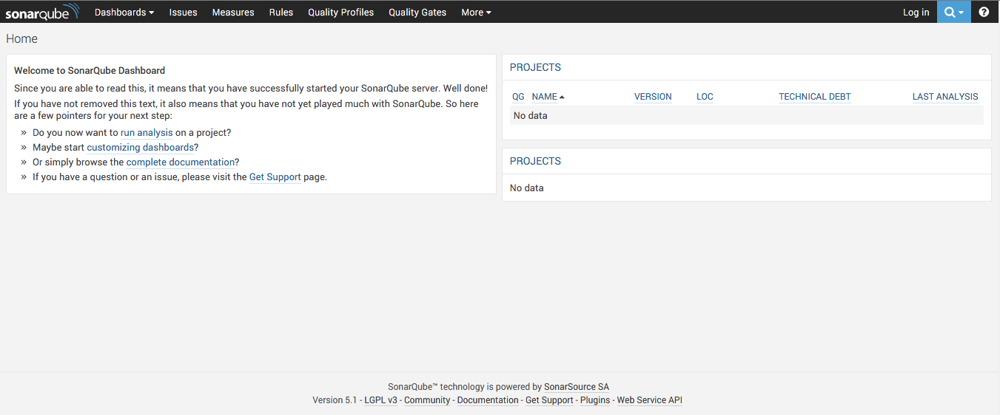

## Dockerfile: Debian - SonarQube

**Dockerfile** of [Debian](https://www.debian.org/) [SonarQube](http://www.sonarqube.org/).

*Requirements*
- [Docker](https://www.docker.com/) 

*Base Docker Image*
- [sonarqube:5.1](https://hub.docker.com/_/sonarqube/)

*Docker Pull Command*
- `docker pull ericmdev/sonarqube`

### Usage

Build the image.

    $ make

Run the container.

    $ make run

Dig into the container.

    $ make exec

*See the `Makefile` for more options.

### SonarQube

Access the SonarQube dashboard `http://<docker-machine ip>:9000/`.

    # Default login
    Username: admin
    Password: admin

Analyse a project.

    $ mvn sonar:sonar